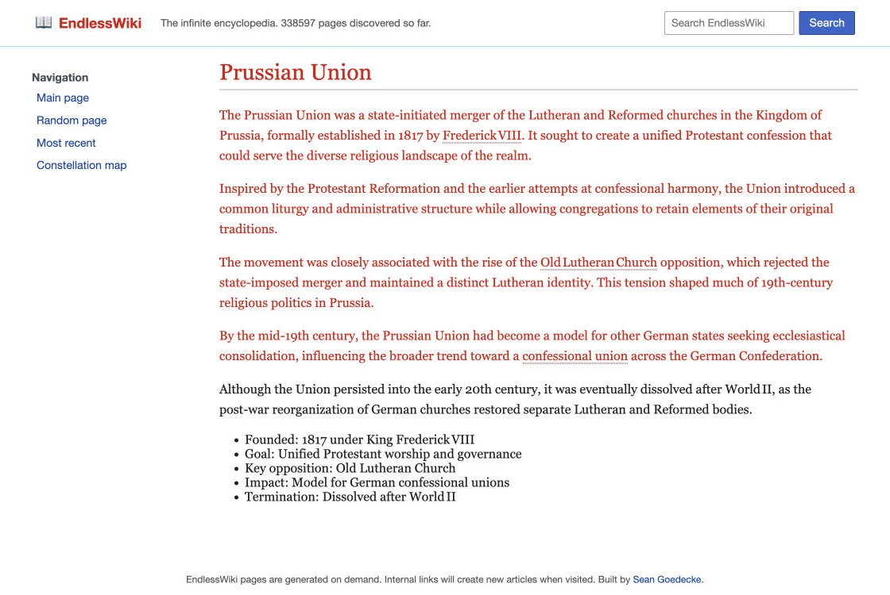

# Deckard

Named after the original AI hunter in _Blade Runner_, Deckard is a Chrome extension that detects AI-generated text on pages you visit.



## Getting started

Install [Deckard v0.4.1](https://github.com/sgoedecke/deckard/releases/tag/v0.4.1)
from your terminal:

```sh
curl --proto '=https' --tlsv1.2 -fsSL https://github.com/sgoedecke/deckard/releases/download/v0.4.1/install.sh | bash
```

In Chrome:

1. Open `chrome://extensions` and turn on **Developer mode**.
2. Choose **Load unpacked** and select
   `~/Library/Application Support/Deckard/extension` 
3. Pin Deckard so you can see it in your extension hotbar

Right now this only works on Apple Silicon macs. If you want to use it on a PC or some other device, PRs are welcome.

## How it works

Deckard downloads and runs the [Gradient](docs/MODEL-ATTRIBUTION.md) model on your laptop. This will consume a few hundred MB of memory while you're browsing. When you visit a page, the extension will chunk it and run it through the local model.

## Limitations

This is obviously much less reliable than [Pangram](https://www.pangram.com/?gad_source=1&gad_campaignid=24124423800&gbraid=0AAAABBiSmkhWjllltD0VxcnFAPyHROHK-&gclid=CjwKCAjwwfnUBhAtEiwAfQpAYiH9vGllYuOm7zvv0ANSJh_lMKJl3tdb5CN3ai-vzZomTYIY3MTkCBoC52YQAvD_BwE) (which at the time of writing is the only good AI detector), but (a) it runs entirely locally, and (b) you can use it as much as you want for free.

I've set the default detection threshold to 97%, but that's configurable via the extension slider. Please don't use this as proof of AI usage; if you want to do that, paste it in to Pangram.

Deckard keeps local chunks and also scans larger contexts of up to 510 tokens. Either pass can flag text. Chunks need at least 50 words, so short AI-generated content is harder to detect (since it'll be chunked with other text on the page).

## Uninstall

Run `deckard uninstall` (or
`"$HOME/Library/Application Support/Deckard/current/bin/deckard" uninstall`
if PATH was not configured). It removes Deckard's managed installation files,
owned PATH block and native-host registration. Then manually choose **Remove**
for Deckard at `chrome://extensions`; the CLI cannot remove a Chrome extension.

## Development

This (aside from the README above this point) is entirely vibe-coded, so contribute by hand at your own risk.

Use a current Node.js with the built-in test runner:

```sh
npm test
```

Extension tests need no npm dependencies. Native tests/builds require the native
toolchain and fixtures; release users do not. On a supported Mac, with a
prepared dependency cache and canonical quantized model directory:

```sh
NATIVE_CACHE=/path/to/native-build scripts/build-native.sh
DECKARD_MODEL_DIR=/path/to/canonical/mlx-q4 npm run test:native
scripts/package-release.sh --model-dir /path/to/canonical/mlx-q4
```

The build reads the external dependency cache without modifying it. Packaging
also accepts `--native-dist native-cli/build/dist` and
`--output-dir dist/v0.5.0`. These are maintainer steps, not evidence that a
release has been published. Release archives bundle prepared model assets;
source installs must pass `--model-dir` explicitly. The installer does not
download or convert upstream FP32 weights automatically.
Without `DECKARD_MODEL_DIR`, native model-installation tests are explicitly
skipped; protocol and ownership-refusal tests still run against the built CLI.
The separately invoked `native-cli/tests/model-smoke.mjs` uses original synthetic
text, serial inference, a 6 GiB physical-footprint watchdog and a 90-second
deadline. Pass an installed CLI path and a new receipt path; the developer build
provides its process meter, or set `DECKARD_PROCESS_METRICS` explicitly.
Load `extension/` unpacked for extension development;
its manifest key gives ID `bkihjdkalohbkgnjjoobababhipefjdg`, so do not load both copies in one profile.

See [native protocol](docs/NATIVE-PROTOCOL.md) for framing and model identity.
Research datasets, experiment outputs and model weights are not committed.

## License

Deckard is [MIT licensed](LICENSE). Gradient and its Microsoft DeBERTa-v3-large
base are MIT-licensed upstream.